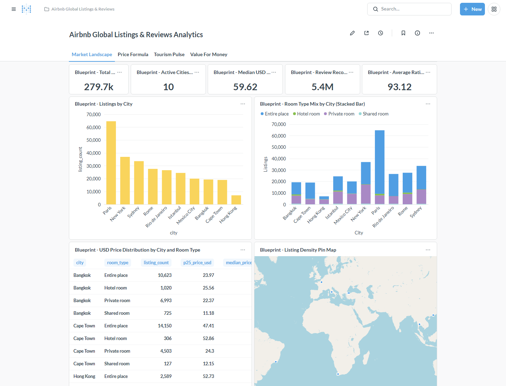

# Airbnb Global Listings & Reviews Analytics

This project turns a global Airbnb listings and reviews dataset into a hospitality analytics dashboard for market comparison, pricing signals, tourism seasonality, COVID recovery, and traveler value-for-money.

Live dashboard: [Metabase collection](https://data.youngllilo.works/collection/6-airbnb)

## Project Context

The dataset covers 279,712 Airbnb listings and 5,373,143 historical reviews across 10 global cities:

`Paris -> New York -> Sydney -> Rome -> Rio de Janeiro -> Istanbul -> Mexico City -> Bangkok -> Cape Town -> Hong Kong`

The project uses `CRISP-DM`, Python, SQL, Supabase Postgres, and Metabase. Prices are normalized to USD using fixed 2020 annual-average exchange rates. Review text sentiment is out of scope because the available dataset does not include a separate review-comments file; listing review scores are used as the satisfaction proxy.

## Goals

- compare listing density, room type mix, and price levels across 10 global markets
- identify key listing features associated with higher USD prices
- test whether Superhost status carries a price premium after city and room-type segmentation
- use historical reviews as a tourism pulse for seasonality and COVID recovery
- rank cities by a custom value-for-money index

## What Are the Steps to Do

### 1. Context, Goals, and Approach

I framed the portfolio as a hospitality analytics case, not a room-counting report. The key business questions are where competition is densest, what drives pricing, how tourism demand changed over time, and where travelers get the strongest price-quality balance.

I used `CRISP-DM` as the project structure:

- business understanding: define market, pricing, seasonality, and value questions
- data understanding: inspect listing, host, room, location, price, and review-history fields
- data preparation: normalize currencies, derive amenity flags, aggregate review history, and build dashboard marts
- modeling: create price-driver correlations, Superhost premium calculations, COVID recovery index, and value index
- evaluation and deployment: publish a 4-page Metabase dashboard backed by Supabase/Postgres marts

### 2. Data Preparation

The raw CSV dataset is not included in this repository because the reviews file is large. The repository includes the preparation logic and the small dashboard-ready mart CSVs under [`docs/assets/exports`](docs/assets/exports).

Tools used:

- [`docs/assets/exports/01-analysis.py`](docs/assets/exports/01-analysis.py) for source profiling and core mart generation
- [`docs/assets/exports/04-blueprint-marts.py`](docs/assets/exports/04-blueprint-marts.py) for dashboard-blueprint marts
- [`docs/assets/exports/01-analysis.sql`](docs/assets/exports/01-analysis.sql) for Supabase analytical views from staging tables
- [`docs/assets/exports/03-local-metabase-load.sql`](docs/assets/exports/03-local-metabase-load.sql) for prepared mart table definitions
- [`docs/data-preparation.md`](docs/data-preparation.md) for the data contract and quality notes

What I did with the dataset:

- processed 279,712 listings and 5,373,143 reviews
- normalized city currencies into USD
- built city, room type, price distribution, density, seasonality, Superhost, amenity, and value-for-money marts
- created a monthly review recovery index against a 2019 baseline
- kept raw credentials and raw data outside the repository

### 3. Data Visualize

I used Metabase to build a 4-page dashboard aligned to the project blueprint.

Tools used:

- [`tools/create-metabase-dashboard.ps1`](tools/create-metabase-dashboard.ps1) for repeatable Metabase dashboard creation
- [`docs/assets/exports/02-metabase-questions.sql`](docs/assets/exports/02-metabase-questions.sql) for native SQL questions
- [`docs/assets/exports/metabase-dashboard-spec.md`](docs/assets/exports/metabase-dashboard-spec.md) for page and card definitions
- [`docs/visualization.md`](docs/visualization.md) for dashboard scope and validation notes

Dashboard pages:

- Global Market Overview: KPIs, listings by city, stacked room-type mix, price distribution, listing density map
- Price Formula: correlation heatmap table, driver ranking, Superhost premium heatmap, amenity premium flags
- Tourism Pulse: monthly reviews, city-by-month seasonality heatmap, monthly reviews versus 2019 baseline, peak/stagnation callouts
- Value For Money: city ranking, price-rating scatter, room/city segment ranking, neighbourhood drilldown

The dashboard includes multi-select dropdown filters for `City` and `Room Type`.

## How to Clone the Project

```bash
git clone https://github.com/khanh-pham87/airbnb-global-listings-reviews-analytics.git
cd airbnb-global-listings-reviews-analytics
```

## How to Deploy

1. Create or reuse a Postgres database. For Supabase, use a dedicated `airbnb` schema so it does not overwrite other projects.
2. Run [`docs/assets/exports/03-local-metabase-load.sql`](docs/assets/exports/03-local-metabase-load.sql) to create the mart tables.
3. Import the prepared CSV marts from [`docs/assets/exports`](docs/assets/exports) into the matching `airbnb.mart_*` tables.
4. Sync the database schema in Metabase.
5. Run [`tools/create-metabase-dashboard.ps1`](tools/create-metabase-dashboard.ps1) with your Metabase URL, username, password, database ID, and collection ID.

More detail: [`docs/deployment-guide.md`](docs/deployment-guide.md)

## Screenshot Dashboard



Additional screenshots:

- [`docs/assets/screenshots/metabase-dashboard-price-formula.png`](docs/assets/screenshots/metabase-dashboard-price-formula.png)
- [`docs/assets/screenshots/metabase-dashboard-tourism-pulse.png`](docs/assets/screenshots/metabase-dashboard-tourism-pulse.png)
- [`docs/assets/screenshots/metabase-dashboard-value-for-money.png`](docs/assets/screenshots/metabase-dashboard-value-for-money.png)

## Insights / Learning

- Mexico City, Bangkok, and Istanbul rank highest on the prepared value-for-money index because they combine competitive USD prices with strong review-score proxies.
- Superhost status does not show a meaningful overall positive price correlation; the more useful view is segmented by city and room type.
- Price correlations are modest overall, with accommodates and bedrooms showing the strongest positive numeric relationship with USD price.
- COVID recovery is clearer when monthly review counts are compared to a 2019 baseline rather than viewed as raw volume alone.
- Metabase is a practical BI layer for this project because it supports native SQL questions, dashboard pages, map views, heatmap-style tables, and dropdown filters over prepared marts.
