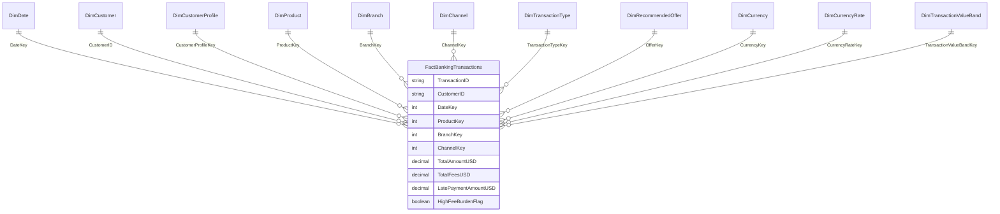
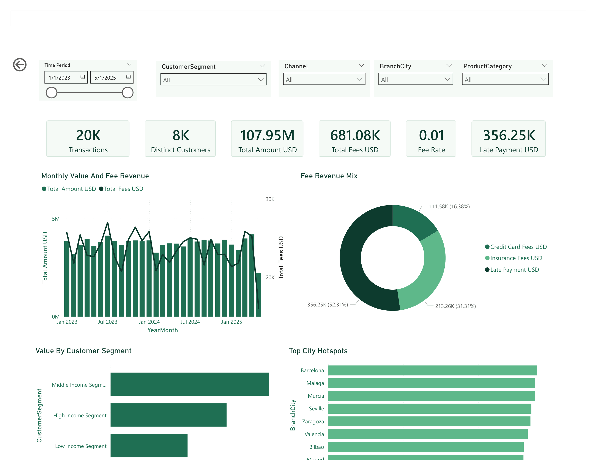

<div align="center">

# Banking Transaction Data Analytics Challenge

### End-to-end banking transaction analytics from prepared data to star schema and Power BI

<p>
  
  
  
</p>

<p>
  
  
  
</p>

<br />

This project turns 20,000 synthetic banking transactions into a Power BI portfolio dashboard for customer segmentation, channel behavior, branch performance, fee revenue, friction signals, and offer alignment.

<p>
  <b>Customer Segmentation</b> &nbsp;.&nbsp;
  <b>Transaction Behavior</b> &nbsp;.&nbsp;
  <b>Fee Revenue</b> &nbsp;.&nbsp;
  <b>Branch Geography</b> &nbsp;.&nbsp;
  <b>Offer Alignment</b> &nbsp;.&nbsp;
  <b>Power BI</b>
</p>

<p>
  <a href="https://app.powerbi.com/view?r=eyJrIjoiNjgyMTFlMGUtZGI1YS00NGMyLTk0ZmEtODUxODRlMzE2NWYzIiwidCI6IjM3MGZiM2I4LTMzMDYtNDg5MC05MDYzLWNjMDhiZTc4ODI1NyIsImMiOjEwfQ%3D%3D">
    
  </a>
</p>

</div>

---

## Project Overview

This project packages a stakeholder-facing banking analytics case as a GitHub-ready portfolio deliverable. It includes prepared transaction data, USD-normalized monetary fields, a Power BI star schema, reusable DAX definitions, Power Query notes, dashboard screenshots, and the published Power BI dashboard URL.

The analysis answers practical banking questions:

- Which customer segments drive the most activity and transaction value?
- Which transaction types and product categories create fee revenue?
- Which channels and branch cities matter most for adoption and value?
- Where do late-payment and high-fee-burden signals suggest friction?
- Are recommended offers aligned with observable customer behavior?
- How can the dataset be shaped into a maintainable Power BI model?

## Table of Contents

- [Project Overview](#project-overview)
- [Project Highlights](#project-highlights)
- [Repository Structure](#repository-structure)
- [Dataset Snapshot](#dataset-snapshot)
- [Data Assets](#data-assets)
- [Data Pipeline](#data-pipeline)
- [How to Run](#how-to-run)
- [Analytical Themes](#analytical-themes)
- [Dimensional Model](#dimensional-model)
- [Power BI Dashboard](#power-bi-dashboard)
- [Key Findings](#key-findings)
- [Validation](#validation)
- [Limitations](#limitations)
- [Future Improvements](#future-improvements)
- [Project Summary](#project-summary)

## Project Highlights

| Area | What this project does |
| --- | --- |
| Data understanding | Profiles transaction count, customer count, date range, currencies, duplicates, missing values, and monetary totals. |
| Data preparation | Converts transaction dates, adds calendar fields, preserves original currency values, and normalizes reporting values to USD. |
| FX auditability | Uses daily historical EUR/USD rates from the Frankfurter API with ECB rates; weekends and non-publication dates use the previous available published rate. |
| Feature engineering | Adds fee totals, friction flags, late-payment exposure, score bands, income bands, value bands, and high-fee-burden candidates. |
| BI-ready data model | Exports a fact table plus dimensions for date, customer, profile, product, branch, channel, transaction type, offer, currency, FX rate, and value band. |
| Power BI delivery | Includes `.pbix` files, DAX measure definitions, Power Query notes, screenshots, and a published Power BI report. |
| Portfolio packaging | Keeps setup, validation, and deployment notes in `docs/` so reviewers can inspect or reproduce the work from a clone. |

## Repository Structure

```text
Banking Transaction Data Analytics Challenge/
|-- docs/
|   |-- assets/
|   |   |-- exports/
|   |   `-- screenshots/
|   |-- dax-measures.md
|   |-- deployment-guide.md
|   |-- power-query-transformations.md
|   |-- publish.md
|   |-- validation-report.md
|   `-- visualization.md
|-- powerbi/
|   |-- banking-transaction-analytics.pbix
|   `-- banking-transaction-analytics-star-schema.pbix
|-- tools/
|   |-- banking-analysis.sql
|   `-- build-banking-star-schema.py
|-- requirements.txt
`-- README.md
```

## Dataset Snapshot

The dataset simulates internal banking transaction records across checking accounts, loans, mortgages, savings accounts, and credit card activity. Each transaction includes customer profile attributes, product and channel details, branch geography, fees, late-payment exposure, currency, and recommended offer.

| Metric | Value |
| --- | ---: |
| Transactions | 20,000 |
| Distinct Customers | 8,025 |
| Date Range | 2023-01-01 to 2025-05-20 |
| Source Currencies | EUR, USD |
| Reporting Currency | USD |
| EUR/USD Rate Range Used | 1.0198 to 1.1476 |
| Total Amount USD | $107,954,758.28 |
| Total Fee Revenue USD | $681,084.03 |
| Credit Card Fees USD | $111,575.13 |
| Insurance Fees USD | $213,261.25 |
| Late Payment USD | $356,247.65 |
| High-Fee Burden Candidates | 1,371 |

## Data Assets

### Core prepared files

| File | Description |
| --- | --- |
| `docs/assets/exports/banking-transactions-prepared-usd.csv` | Prepared transaction-level table with original monetary fields and USD-normalized reporting fields. |
| `docs/assets/exports/currency-rates-to-usd.csv` | FX audit table with rate source, rate date, and conversion rate used for reporting. |
| `docs/assets/exports/data-dictionary.csv` | Field-level reference for the prepared data package. |
| `docs/assets/exports/analysis-summary.md` | Compact profile, validation notes, and key analytical summaries. |

### Power BI star schema files

| File | Description |
| --- | --- |
| `docs/assets/exports/fact-banking-transactions-star.csv` | Transaction-level fact table for the Power BI star schema. |
| `docs/assets/exports/dim-date-star.csv` | Date dimension for reporting calendar and trend analysis. |
| `docs/assets/exports/dim-customer.csv` | Customer identity dimension for distinct customer analysis. |
| `docs/assets/exports/dim-customer-profile.csv` | Customer profile dimension for segment, score band, and income band analysis. |
| `docs/assets/exports/dim-product.csv` | Product category and subcategory dimension. |
| `docs/assets/exports/dim-branch.csv` | Branch city and geography dimension. |
| `docs/assets/exports/dim-channel.csv` | Channel dimension for mobile, branch, ATM, and online behavior. |
| `docs/assets/exports/dim-transaction-type.csv` | Transaction type dimension. |
| `docs/assets/exports/dim-recommended-offer.csv` | Recommended offer dimension. |
| `docs/assets/exports/dim-currency.csv` | Source currency dimension. |
| `docs/assets/exports/dim-currency-rate.csv` | FX-rate dimension used for audit and drillthrough. |
| `docs/assets/exports/dim-transaction-value-band.csv` | Value-band dimension for transaction-size analysis. |

### Reporting files

| File | Description |
| --- | --- |
| `powerbi/banking-transaction-analytics.pbix` | Original Power BI report file. |
| `powerbi/banking-transaction-analytics-star-schema.pbix` | Power BI report built around the star-schema outputs. |
| `docs/assets/screenshots/power-bi-page-1.png` | Executive Overview screenshot. |
| `docs/assets/screenshots/power-bi-page-2.png` to `power-bi-page-6.png` | Additional report page screenshots. |

## Data Pipeline

```mermaid
flowchart LR
    A["Synthetic banking transactions"] --> B["Data profiling<br/>rows, customers, dates, currencies"]
    B --> C["Preparation<br/>types, calendar, fees, friction fields"]
    C --> D["USD normalization<br/>historical EUR/USD rates"]
    D --> E["Prepared transaction table"]
    E --> F["Star schema builder<br/>build-banking-star-schema.py"]
    F --> G["Fact and dimension CSVs"]
    G --> H["Power BI model<br/>single-direction relationships"]
    H --> I["Power BI dashboard<br/>published report"]
```



The reproducible build script is:

- `tools/build-banking-star-schema.py`

The SQL analysis reference is:

- `tools/banking-analysis.sql`

## How to Run

### 1. Clone or open the project

```bash
cd "Banking Transaction Data Analytics Challenge"
```

### 2. Create a Python environment

```bash
python -m venv .venv
```

On Windows:

```bash
.venv\Scripts\activate
```

On Linux or macOS:

```bash
source .venv/bin/activate
```

### 3. Install dependencies

```bash
pip install -r requirements.txt
```

### 4. Rebuild the prepared star schema

```bash
python tools/build-banking-star-schema.py
```

Expected validation after running:

- fact rows: `20,000`
- duplicate transaction IDs: `0`
- missing foreign keys: `0`
- total amount USD: `$107,954,758.28`
- total fees USD: `$681,084.03`

### 5. Open the Power BI report

1. Open `powerbi/banking-transaction-analytics-star-schema.pbix` in Power BI Desktop.
2. If prompted, update CSV paths to your local clone under `docs/assets/exports`.
3. Refresh the report.
4. Check the KPI cards against the validation numbers above.

## Analytical Themes

### 1. Customer Segmentation

- Activity and value by `CustomerSegment`.
- Income-band and score-band comparison.
- Fee per customer and high-fee-burden candidates.
- Product preference by segment.

### 2. Transaction Behavior

- Transaction count versus value by transaction type.
- Product category and subcategory mix.
- Transaction value bands and unusually large transactions.
- Monthly and seasonal patterns.

### 3. Fee Revenue and Friction

- Total fee revenue from credit card fees, insurance fees, and late-payment amounts.
- Fee burden by customer segment and product category.
- Late-payment exposure and friction flags.
- Candidate groups for retention, education, or fee-policy review.

### 4. Branch, Channel, and Geography

- Branch-city ranking by transaction value, activity, and fee revenue.
- Channel mix across mobile, online, ATM, and branch activity.
- City-level hotspots and underperforming locations.
- Geography should be interpreted at branch-city level, not exact branch routing.

### 5. Offer Alignment

- Recommended offer distribution by segment, product, and behavior.
- Offer-to-behavior fit using transaction history and customer profile signals.
- Opportunities for personalization and product targeting.

## Dimensional Model



Modeling rules:

- Use one-to-many relationships from dimensions to `FactBankingTransactions`.
- Keep filter direction single from dimension to fact.
- Mark `DimDate[Date]` as the date table.
- Use `DimCustomerProfile` for segment, score-band, and income-band visuals.
- Use `DimCustomer` for customer identity and customer-level tables.

Supporting reference docs:

- `docs/dax-measures.md`
- `docs/power-query-transformations.md`
- `docs/deployment-guide.md`

## Power BI Dashboard

Published dashboard:

[View the published Power BI dashboard](https://app.powerbi.com/view?r=eyJrIjoiNjgyMTFlMGUtZGI1YS00NGMyLTk0ZmEtODUxODRlMzE2NWYzIiwidCI6IjM3MGZiM2I4LTMzMDYtNDg5MC05MDYzLWNjMDhiZTc4ODI1NyIsImMiOjEwfQ%3D%3D)

Local report files:

- `powerbi/banking-transaction-analytics.pbix`
- `powerbi/banking-transaction-analytics-star-schema.pbix`

Report pages:

1. Executive Overview
2. Customer Segments
3. Transaction Behavior
4. Revenue And Friction
5. Branch And Geography
6. Trends And Offers

Dashboard screenshot:



Additional screenshots:

- `docs/assets/screenshots/power-bi-page-2.png`
- `docs/assets/screenshots/power-bi-page-3.png`
- `docs/assets/screenshots/power-bi-page-4.png`
- `docs/assets/screenshots/power-bi-page-5.png`
- `docs/assets/screenshots/power-bi-page-6.png`

## Key Findings

- Middle-income customers are the largest activity and value segment, with 8,885 transactions and $48.65M in transaction value.
- Loan payment transactions generate the highest fee revenue, contributing about $409.94K of the $681.08K total fee pool.
- Barcelona, Malaga, and Murcia are the strongest branch-city value hotspots, each near $13.8M to $13.9M in total value.
- Withdrawal, loan payment, transfer, deposit, and card payment transaction types each sit near $17.8M to $18.2M in total value.
- Fee burden should be treated as an analytical signal, not a formal credit-risk score, because the dataset does not include true default labels.
- The dimensional model makes the Power BI report easier to maintain than a single wide fact table and gives the project a more professional BI architecture.

## Validation

The project validation report is stored at:

- `docs/validation-report.md`

Core checks:

| Check | Result |
| --- | ---: |
| Source row count | 20,000 |
| Prepared row count | 20,000 |
| Duplicate `TransactionID` count | 0 |
| Missing source values across 19 source fields | 0 |
| Star fact rows | 20,000 |
| Missing foreign keys | 0 |
| `DimCustomer` rows | 8,025 |
| Star-schema total amount USD | $107,954,758.28 |
| Star-schema total fee revenue USD | $681,084.03 |

## Limitations

- The dataset is synthetic and should be used for portfolio demonstration, not production banking decisions.
- High-fee-burden candidates are analytical candidates, not credit-risk classifications.
- Recommended offers are interpreted as bank-generated recommendations, not accepted offers.
- Branch latitude and longitude appear city-level, so maps should be read as city-level branch analysis.
- Customer profile changes exist in the synthetic data; use `DimCustomerProfile` for profile filtering and `DimCustomer` for customer identity.
- Power BI refresh depends on local CSV paths unless the report is repointed to a managed storage or service refresh setup.

## Future Improvements

- Move the reporting model to a warehouse or lakehouse source instead of local CSV paths.
- Add Power BI Service scheduled refresh with managed credentials and gateway configuration.
- Add more robust offer-effectiveness analysis if accepted-offer or campaign-response fields become available.
- Add formal customer risk modeling only if true target labels and governance requirements are available.
- Add automated Markdown/link validation for portfolio release checks.

## Project Summary

This project moves from transaction-level banking data to business-ready Power BI analytics. It cleans and enriches transaction records, normalizes monetary reporting to USD, creates a BI-friendly star schema, documents DAX and Power Query logic, and publishes a dashboard for customer, channel, fee, branch, trend, and offer analysis.
