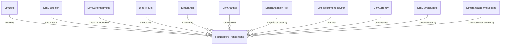

# Power BI Star Schema Upgrade Guide

Use this guide to upgrade the current flat-file Power BI dashboard into a portfolio-style dimensional model.

## What Changed

The old dashboard can keep working from:

- `docs/assets/exports/banking-transactions-prepared-usd.csv`

The upgraded model uses:

- `docs/assets/exports/fact-banking-transactions-star.csv`
- `docs/assets/exports/dim-date-star.csv`
- `docs/assets/exports/dim-customer.csv`
- `docs/assets/exports/dim-customer-profile.csv`
- `docs/assets/exports/dim-product.csv`
- `docs/assets/exports/dim-branch.csv`
- `docs/assets/exports/dim-channel.csv`
- `docs/assets/exports/dim-transaction-type.csv`
- `docs/assets/exports/dim-recommended-offer.csv`
- `docs/assets/exports/dim-currency.csv`
- `docs/assets/exports/dim-currency-rate.csv`
- `docs/assets/exports/dim-transaction-value-band.csv`

## Model Diagram



## Step 1: Save A Copy

In Power BI Desktop:

1. Open the current `.pbix`.
2. Save As: `banking-transaction-analytics-star-schema.pbix`.
3. Keep the old `.pbix` as backup.

## Step 2: Import Star Tables

Go to `Home > Get data > Text/CSV`.

Import each CSV from:

```text
<cloned-repo-path>\docs\assets\exports
```

Rename tables in Power BI:

| CSV | Power BI table name |
|---|---|
| `fact-banking-transactions-star.csv` | `FactBankingTransactions` |
| `dim-date-star.csv` | `DimDate` |
| `dim-customer.csv` | `DimCustomer` |
| `dim-customer-profile.csv` | `DimCustomerProfile` |
| `dim-product.csv` | `DimProduct` |
| `dim-branch.csv` | `DimBranch` |
| `dim-channel.csv` | `DimChannel` |
| `dim-transaction-type.csv` | `DimTransactionType` |
| `dim-recommended-offer.csv` | `DimRecommendedOffer` |
| `dim-currency.csv` | `DimCurrency` |
| `dim-currency-rate.csv` | `DimCurrencyRate` |
| `dim-transaction-value-band.csv` | `DimTransactionValueBand` |

If the old flat table already uses `FactBankingTransactions`, rename it first to `FactBankingTransactions_Flat_Backup`.

## Step 3: Set Data Types

Set these key fields as text:

- `ProductKey`
- `BranchKey`
- `ChannelKey`
- `TransactionTypeKey`
- `OfferKey`
- `CurrencyKey`
- `CurrencyRateKey`
- `CustomerProfileKey`
- `TransactionValueBandKey`

Set these key fields as whole number:

- `TransactionID`
- `CustomerID`
- `DateKey`

Set financial fields as decimal number or fixed decimal:

- `AmountOriginal`
- `AmountUSD`
- `CreditCardFeesUSD`
- `InsuranceFeesUSD`
- `LatePaymentAmountUSD`
- `TotalFeesUSD`
- `MonthlyIncome`

Set flags as true/false:

- `HasFeeFriction`
- `HasLatePayment`
- `HighFeeBurdenFlag`

## Step 4: Create Relationships

Go to `Model view`.

Create these relationships, all `One-to-many`, single filter direction from dimension to fact:

| From | To |
|---|---|
| `DimDate[DateKey]` | `FactBankingTransactions[DateKey]` |
| `DimCustomer[CustomerID]` | `FactBankingTransactions[CustomerID]` |
| `DimCustomerProfile[CustomerProfileKey]` | `FactBankingTransactions[CustomerProfileKey]` |
| `DimProduct[ProductKey]` | `FactBankingTransactions[ProductKey]` |
| `DimBranch[BranchKey]` | `FactBankingTransactions[BranchKey]` |
| `DimChannel[ChannelKey]` | `FactBankingTransactions[ChannelKey]` |
| `DimTransactionType[TransactionTypeKey]` | `FactBankingTransactions[TransactionTypeKey]` |
| `DimRecommendedOffer[OfferKey]` | `FactBankingTransactions[OfferKey]` |
| `DimCurrency[CurrencyKey]` | `FactBankingTransactions[CurrencyKey]` |
| `DimCurrencyRate[CurrencyRateKey]` | `FactBankingTransactions[CurrencyRateKey]` |
| `DimTransactionValueBand[TransactionValueBandKey]` | `FactBankingTransactions[TransactionValueBandKey]` |

Then select `DimDate`, choose `Mark as date table`, and use `DimDate[Date]`.

## Step 5: Set Sort By Column

Set:

- `DimDate[MonthName]` sort by `DimDate[MonthNumber]`
- `DimDate[YearMonth]` sort by `DimDate[MonthStart]`
- `DimCustomerProfile[CreditScoreBand]` sort by `DimCustomerProfile[CreditScoreBandOrder]`
- `DimCustomerProfile[MonthlyIncomeBand]` sort by `DimCustomerProfile[MonthlyIncomeBandOrder]`
- `DimTransactionValueBand[TransactionValueBandUSD]` sort by `DimTransactionValueBand[TransactionValueBandOrder]`

## Step 6: Replace Visual Fields

Do not rebuild every page from scratch. Replace fields gradually.

| Old flat field | New dimension field |
|---|---|
| `FactBankingTransactions[TransactionDate]` | `DimDate[Date]` or `DimDate[YearMonth]` |
| `FactBankingTransactions[CustomerSegment]` | `DimCustomerProfile[CustomerSegment]` |
| `FactBankingTransactions[CreditScoreBand]` | `DimCustomerProfile[CreditScoreBand]` |
| `FactBankingTransactions[MonthlyIncomeBand]` | `DimCustomerProfile[MonthlyIncomeBand]` |
| `FactBankingTransactions[ProductCategory]` | `DimProduct[ProductCategory]` |
| `FactBankingTransactions[ProductSubcategory]` | `DimProduct[ProductSubcategory]` |
| `FactBankingTransactions[BranchCity]` | `DimBranch[BranchCity]` |
| `FactBankingTransactions[Channel]` | `DimChannel[Channel]` |
| `FactBankingTransactions[TransactionType]` | `DimTransactionType[TransactionType]` |
| `FactBankingTransactions[RecommendedOffer]` | `DimRecommendedOffer[RecommendedOffer]` |
| `FactBankingTransactions[Currency]` | `DimCurrency[Currency]` |
| `FactBankingTransactions[TransactionValueBandUSD]` | `DimTransactionValueBand[TransactionValueBandUSD]` |

Keep measures on `FactBankingTransactions`.

## Step 7: Hide Technical Fields

Hide these fields from report view:

- all `*Key` fields in the fact table
- `CurrencyRateKey`
- `DateKey`
- `SegmentVersionCount`
- `ScoreVersionCount`
- `IncomeVersionCount`

Keep them visible only while you are building relationships.

## Step 8: Validate Totals

Create or check these cards:

| KPI | Expected value |
|---|---:|
| Transactions | `20,000` |
| Distinct Customers | `8,025` |
| Total Amount USD | `$107,954,758.28` |
| Total Fees USD | `$681,084.03` |
| High Fee Burden Transactions | `1,371` |

If these totals differ, check that all relationships are single-direction and that visuals are not filtered.

## Important Customer Note

`CustomerID` is not fully stable in the source data: many customers appear with more than one segment, score, or income value. To avoid wrong filters:

- Use `DimCustomerProfile` for segment, credit-score band, and income-band visuals.
- Use `DimCustomer` for customer-level tables and customer counts.
- Do not use `DimCustomer[PrimaryCustomerSegment]` for transaction-level segment analysis.

## Recommended Upgrade Order

1. Import star tables.
2. Create relationships.
3. Recreate the KPI cards.
4. Replace slicer fields.
5. Replace Page 1 visuals.
6. Replace the remaining pages one by one.
7. Remove the old flat backup table only after all totals match.
